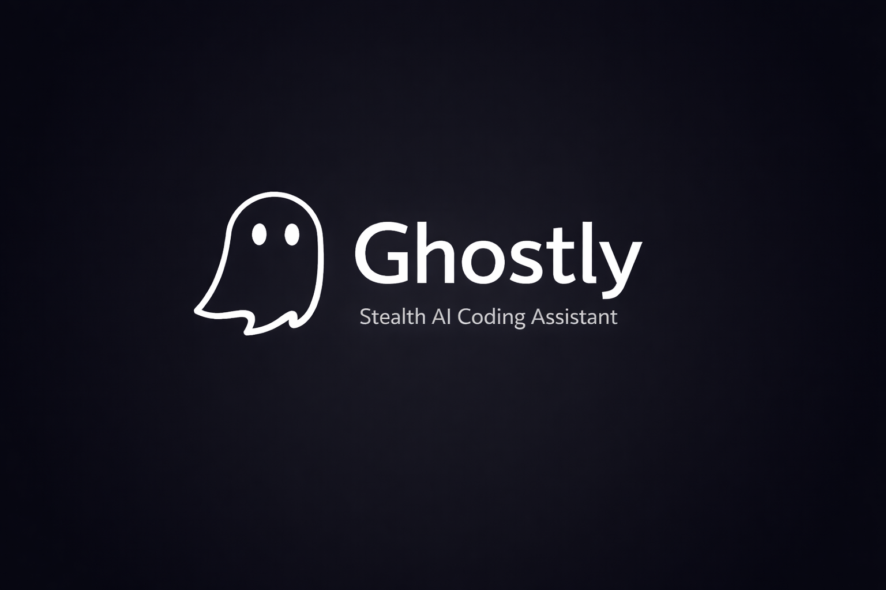
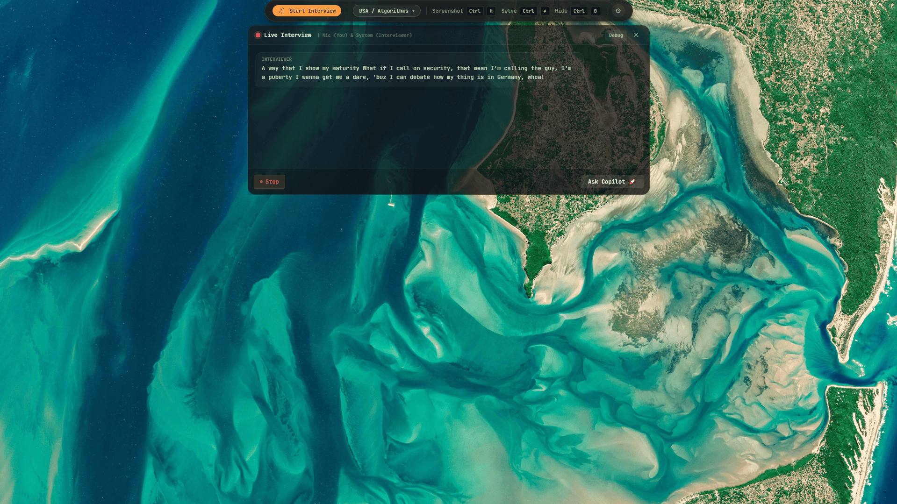
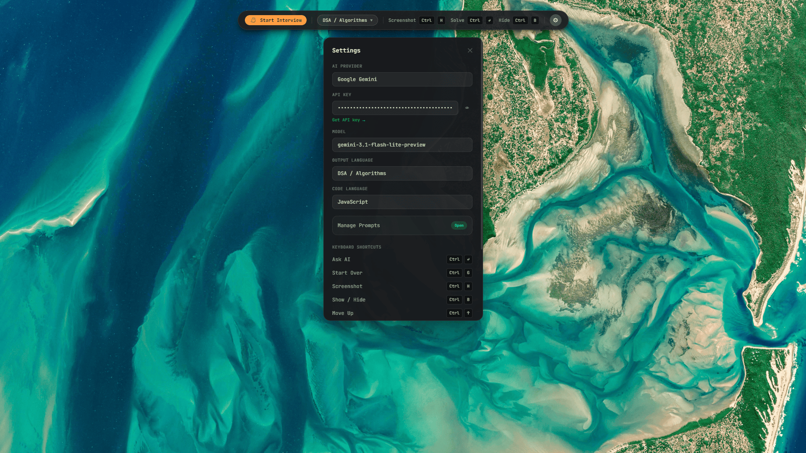
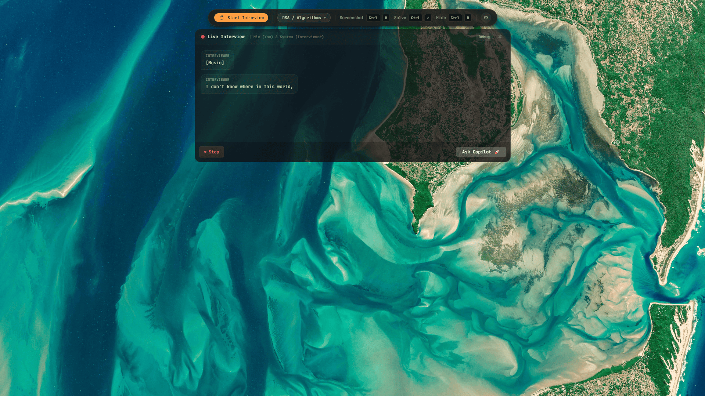
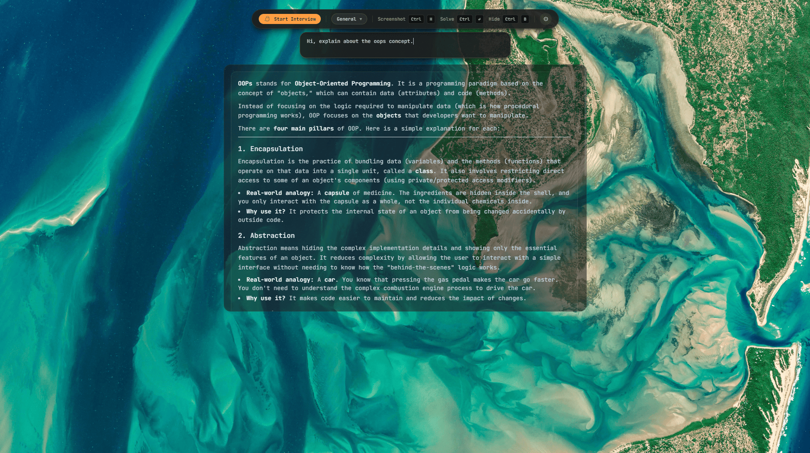

# 👻 Ghostly — Stealth AI Coding Assistant



A powerful desktop application that runs as an invisible overlay, capturing screen regions, transcribing audio, and streaming AI-powered solutions. Built specifically for ultimate stealth — it remains completely invisible to screen share platforms like Zoom, Google Meet, OBS, and MS Teams.

---

## ✨ Key Features

### 🕵️‍♂️ Ultimate Stealth & Invisible Overlay

- **Screen-Share Proof**: Utilizes hardware-level window exclusion (`setContentProtection(true)`) so the app never shows up on screen shares or recordings.
- **Click-Through Transparency**: The UI lets your mouse clicks pass through to underlying applications, ensuring zero interruption to your regular workflow or IDE usage.
- **Taskbar Hidden**: No icons in the taskbar; operates purely as a background utility with a discrete system tray icon.

### 🎙️ Live Interview Transcription

- **Real-time Audio Processing**: Transcribe live interviews, meetings, and technical discussions as they happen.
- **Automated Context**: Feeds the spoken conversation context directly to the AI to understand exactly what is being asked and generate highly relevant coding solutions dynamically.

### 📸 Intelligent Screen Capture & Vision

- **Region Selector UI**: Drag a simple crosshair over any coding problem, browser window, or terminal to capture the specific context.
- **Real-time Solution Streaming**: Screenshots are passed to your chosen LLM Vision model, streaming back high-quality, formatted code solutions in real-time.

### 💬 Covert Typing & Custom Chats

- **Ask Follow-ups**: Seamlessly type custom questions and prompts directly in the invisible interface while keeping it hidden from viewers.
- **Context-Aware Memory**: The AI remembers the ongoing session to provide continuous, context-aware assistance.

### 🧠 Multi-Provider AI Support

- Connect your own API keys for ultimate privacy and control.
- Supported providers include: **Google Gemini** (default, excellent vision features), **OpenAI**, **Anthropic**, and **Groq** (for blazing-fast text responses).
- **Encrypted Storage**: API keys, user settings, and session history are securely stored and encrypted locally via `electron-store`.

### 🎨 Premium Interface Focus

- **Dark Glassmorphism UX**: Sleek, modern, and non-distracting visual design.
- **Global Hotkeys**: Trigger captures, clear the screen, or hide the app instantly from anywhere.

## 📸 Screenshots








## ⌨️ Keyboard Shortcuts

| Shortcut            | Action                             |
| ------------------- | ---------------------------------- |
| `Ctrl/Cmd + H`      | Capture screenshot & load          |
| `Ctrl/Cmd + Enter`  | Solve / Ask AI                     |
| `Ctrl/Cmd + B`      | Toggle show / hide app             |
| `Ctrl/Cmd + G`      | Start over / clear current session |
| `Ctrl/Cmd + Arrows` | Move Ghostly window position       |

## 🚀 Quick Start

### Prerequisites

- Node.js 18+
- npm 9+

### Install & Run

```bash
# Install dependencies
npm install

# Start in development mode
npm run dev
```

### Build for Production

```bash
# Build
npm run build

# Package (.exe / .dmg)
npm run package
```

## ⚙️ Configuration

1. Launch Ghostly
2. Navigate to **Settings** (⚙️ tab)
3. Expand your chosen provider
4. Paste your API key
5. Click **Set as Active Provider**
6. Select your preferred model, interview type, and language

## 🤖 Supported Providers

| Provider        | Free Tier   | Vision     | Speed        | Get Key                                                              |
| --------------- | ----------- | ---------- | ------------ | -------------------------------------------------------------------- |
| **Gemini** ✦    | ✅ Generous | ✅         | ⚡ Fast      | [aistudio.google.com](https://aistudio.google.com/app/apikey)        |
| **OpenAI** ◈    | ❌ Paid     | ✅         | ⚡ Fast      | [platform.openai.com](https://platform.openai.com/api-keys)          |
| **Anthropic** ◉ | ❌ Paid     | ✅         | 🐢 Moderate  | [console.anthropic.com](https://console.anthropic.com/settings/keys) |
| **Groq** ⚡     | ✅ Free     | ⚠️ Limited | ⚡⚡ Fastest | [console.groq.com](https://console.groq.com/keys)                    |

## 📁 Project Structure

```
ghostly/
├── electron/          # Electron main process
│   ├── main.ts        # App entry, tray, window management
│   ├── overlay.ts     # Invisible overlay window
│   ├── capture.ts     # Screen capture (full + region)
│   ├── hotkeys.ts     # Global shortcuts
│   ├── ipc.ts         # IPC handlers + electron-store
│   └── preload.ts     # contextBridge API
├── src/               # React renderer
│   ├── App.tsx        # Root with router + nav
│   ├── pages/         # Home, Settings, History
│   ├── components/    # SolutionCard, RegionSelector, etc.
│   ├── hooks/         # useCapture, useAIStream
│   ├── lib/ai/        # Provider implementations
│   ├── store/         # Zustand state management
│   └── styles/        # Tailwind + custom CSS
├── electron-builder.yml
├── electron.vite.config.ts
├── tailwind.config.ts
└── package.json
```

## 🛡️ Stealth Features

- `setContentProtection(true)` — invisible to all screen recording
- `alwaysOnTop: 'screen-saver'` — stays above all windows
- `skipTaskbar: true` — hidden from taskbar
- `transparent: true` + `frame: false` — no window chrome
- System tray icon for quick access

## 📄 License

MIT
